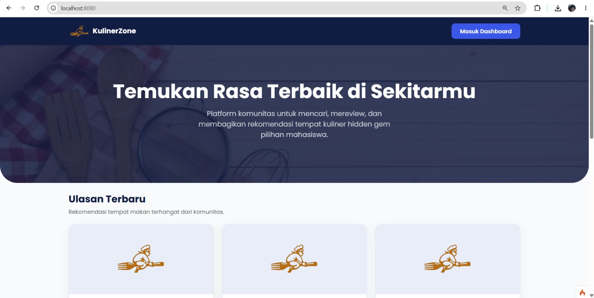
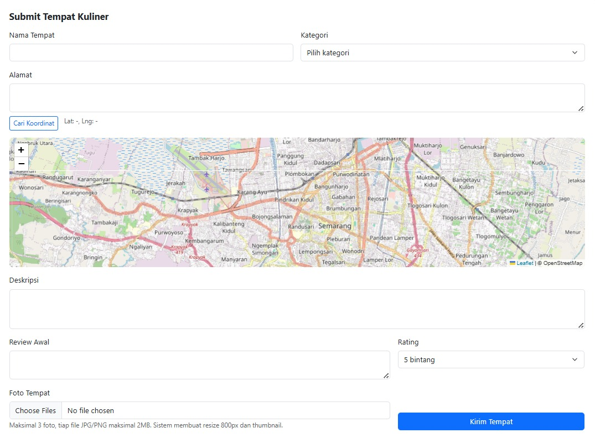
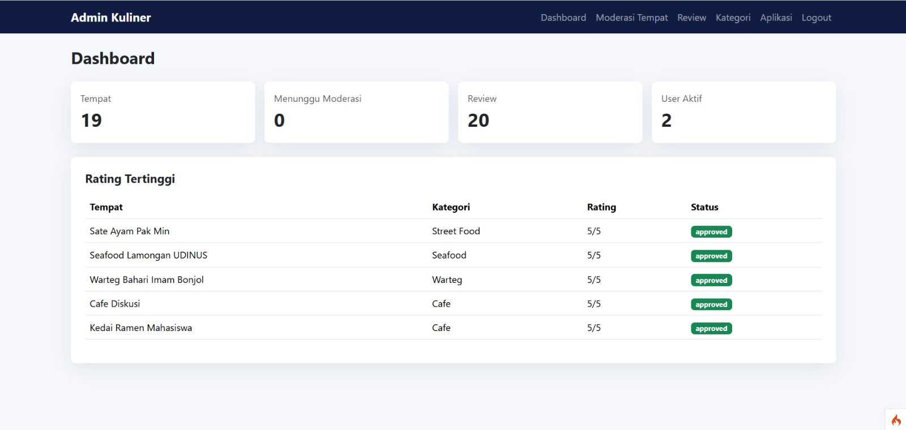
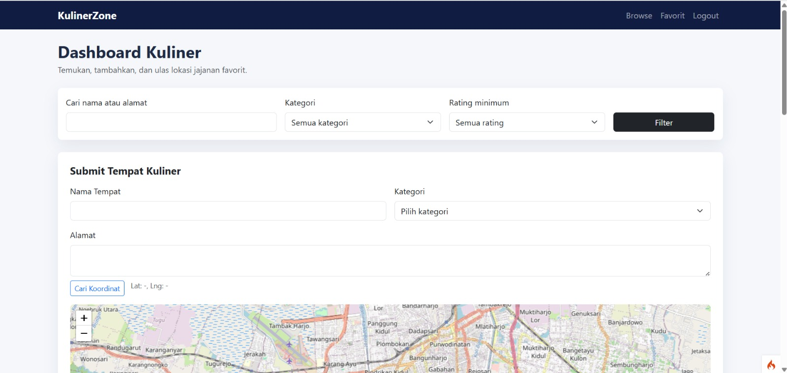
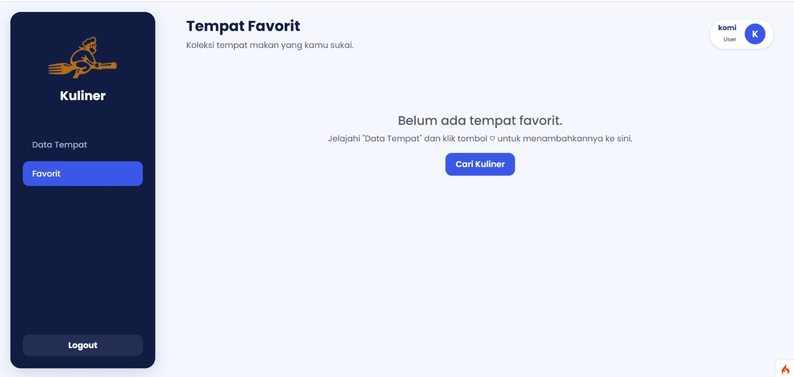

# KulinerZone - Lokasi Kuliner & Review Jajanan

Project CodeIgniter 4 untuk menemukan, menambahkan, dan mengulas tempat kuliner di sekitar kampus. Aplikasi mendukung submit tempat kuliner, geocoding alamat ke koordinat, peta Leaflet, review/rating, favorit, dashboard admin, dan API kuliner.

## Tech Stack

- CodeIgniter 4
- MySQL
- Bootstrap
- Leaflet.js
- OpenStreetMap Nominatim API

## Cara Instalasi

1. Masuk ke folder project:

```bash
cd kuliner-app
```

2. Install dependency Composer:

```bash
composer install
```

3. Copy file environment jika belum ada:

```bash
copy env .env
```

4. Buat database MySQL:

```sql
CREATE DATABASE kuliner_db;
```

5. Jalankan migration:

```bash
php spark migrate
```

6. Jalankan seeder:

```bash
php spark db:seed DatabaseSeeder
```

7. Jalankan server lokal:

```bash
php spark serve
```

8. Buka aplikasi:

```text
http://127.0.0.1:8080
```

## Konfigurasi .env

Pastikan file `.env` berisi konfigurasi berikut:

```ini
CI_ENVIRONMENT = development

app.baseURL = 'http://127.0.0.1:8080/'

database.default.hostname = localhost
database.default.database = kuliner_db
database.default.username = root
database.default.password =
database.default.DBDriver = MySQLi
database.default.DBPrefix =
database.default.port = 3306
```

Jika MySQL memakai password, isi bagian:

```ini
database.default.password = password_mysql_kamu
```

## Akun Demo

Seeder menyediakan dua akun demo:

| Role | Email | Password |
| --- | --- | --- |
| Admin | `admin@gmail.com` | `admin123` |
| User | `user@gmail.com` | `user12345` |

## Fitur Utama

- Login dan register user
- Dashboard user untuk submit tempat kuliner
- Geocoding alamat otomatis menggunakan Nominatim
- Peta lokasi menggunakan Leaflet.js
- Review dan rating kuliner
- Simpan tempat favorit
- Admin dashboard
- Moderasi tempat kuliner approve/reject
- Moderasi review
- Kelola kategori
- Upload foto kuliner dengan resize dan thumbnail
- API webservice kuliner
- Seeder 20+ data kuliner sekitar kampus

## Webservice API

Endpoint API yang tersedia:

```text
GET /api/kuliner
GET /api/kuliner/{id}
GET /api/kuliner?lat=-6.982050&lng=110.409140&radius=2
```

Contoh:

```text
http://127.0.0.1:8080/api/kuliner
```

API mengembalikan data dalam format JSON, berisi nama tempat, alamat, deskripsi, kategori, rating, foto, latitude, longitude, dan distance jika memakai radius.

## Screenshot Fitur Utama

### Halaman Browse Kuliner



### Form Submit Tempat Kuliner



### Dashboard Admin



### Dashboard User



### Halaman Favorit User



## Struktur Koding Penting

| Bagian | File |
| --- | --- |
| Route aplikasi | `app/Config/Routes.php` |
| Controller kuliner | `app/Controllers/Kuliner.php` |
| Controller API | `app/Controllers/API/KulinerApi.php` |
| Client API | `app/Controllers/ClientKuliner.php` |
| Model kuliner | `app/Models/KulinerModel.php` |
| Seeder kuliner | `app/Database/Seeds/KulinerSeeder.php` |
| View daftar kuliner | `app/Views/kuliner_view.php` |
| View detail kuliner | `app/Views/kuliner_detail.php` |
